# Build HeatWave E-Commerce Application

## Introduction

You can use HeatWave to create new applications using the LAMP stack (Linux, Apache, MySQL, PHP) or other software stacks.

In this lab, you will build a LAMP stack and deploy a prebuilt  HeatWave e-commerce application. The in-database LLMs of HeatWave GenAI automatically analyzes the sentiment of user submitted reviews, and summarizes and translate review summaries into other languages. 

### Objectives

In this lab, you will be guided through the following tasks:

- Connect to the HeatWave instance.
- Set up stored procedures.
- Install Apache App Server.
- Install PHP.
- Create HeatWave/PHP connect test app.
- Deploy HeatWave e-commerce application.
- Test HeatWave e-commerce application.

### Prerequisites

- Completed Lab 3.

### About the HeatWave E-Commerce Application

This application provides a user-friendly web interface for interacting with HeatWave GenAI. It enables you to submit a review and then analyze the sentiment of submitted review. You can also summarize and translate review summaries into other languages.

#### HeatWave E-Commerce Application Architecture

For the e-commerce application, you only need a front-end web server and a REST middleware layer with HeatWave GenAI. The components in this application are as following:

- Next.js Front-End
- Strapi Middleware
- HeatWave GenAI

    

The following diagram provides details of how the different components of the HeatWave e-commerce application are structured and how they interact with each other. The arrows indicate the flow of data and interactions between the components. For example:

- The web browser interacts with the web server.
- The PHP Runtime manages the ecommerce.php and HeatWave RAG class.
- The HeatWave RAG class interacts with the HeatWave instance.

    

#### Overview

- Backend: Linux, Apache, PHP, and HeatWave integration
- Frontend: HTML and CSS for a responsive design

This solution bridges the gap between complex database operations and user-friendly interaction, making it easy for users to leverage the power of HeatWave GenAI capabilities through a simple interface.

_Note:_ This application code is intended for educational purposes only. It is designed to help developers learn and practice application development skills with HeatWave on OCI. The code is not designed to be used in a production environment.

_Estimated Time:_ 20 minutes

## Task 1: Connect to the Heatwave Instance

If you are a Linux, Mac, or Windows 10 Powershell user, skip the first step.

1. If you are a Windows user, click the Start menu from your windows machine and search Git Bash. Select the Git Bash, which will take you to the Git Bash terminal.

2. From a terminal window on your local system, connect to the compute instance.

    ```bash
    <copy>ssh -i  <PathtoSSHFile> opc@<ComputeIPAddress></copy>
    ```
    Replace the following:

    - PathtoSSHFile: The path where you stored the SSH file in Lab 2, Task 1, Step 10.
    - ComputeIPAddress: The compute IP address that you created in Lab 2, Task 1, Step 13.

    For example: 

    ```bash
    <copy>ssh -i  C:/Users/MyUser/.ssh/ssh-key-2024.key opc@129.198.47.192</copy>
    ```

    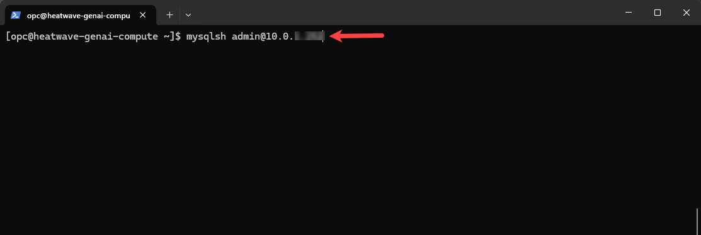

3. Install MySQL Shell on the compute instance.

    ```bash
    <copy>sudo yum install mysql-shell</copy>
    ```

    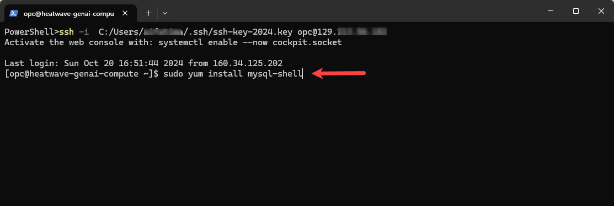

4. After MySQL Shell is installed, connect to the endpoint of the DB system.

    ```bash
    <copy>mysqlsh <DBSystemName>@<DBSystemEndpointIPAddress> </copy>
    ```

    Replace the following:
    
    - DBSystemName: The name of the DB system that you created in  Lab 1, Task 5, Step 5.
    - DBSystemEndpointIPAddress: The DB system private IP address that you noted in Lab 1, Task 5, Step 19.

    For example:

    ```bash
    <copy>mysqlsh admin@10.0.1.100
    ``` 

    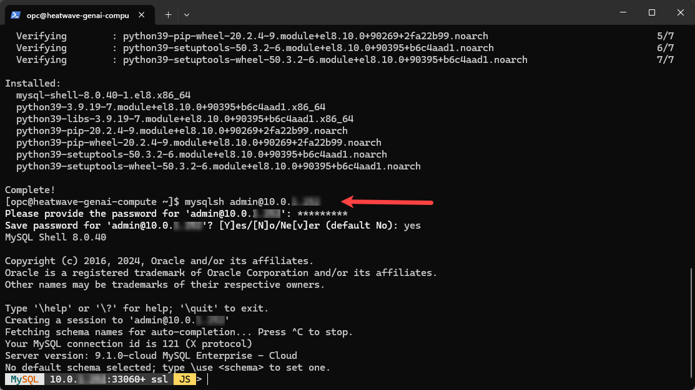


## Task 2: Set up Stored Procedures

1. Once you are connected to the HeatWave instance, change to the SQL mode.

    ```bash
    <copy>\sql</copy>
    ```

    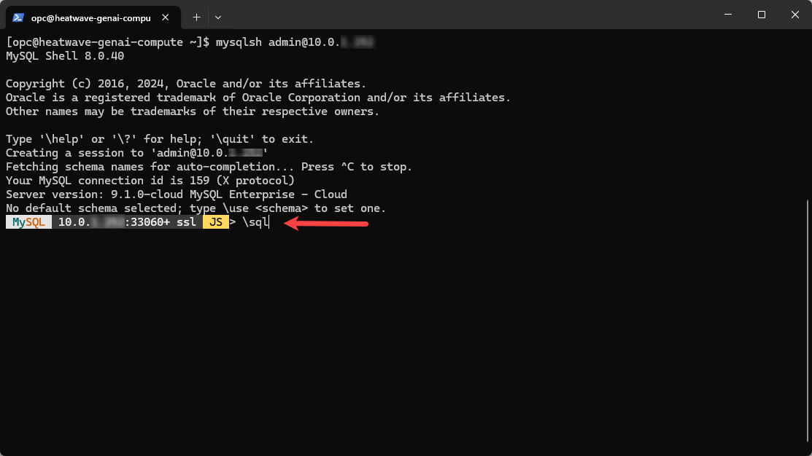

2. Create a new schema and select it.

    ```bash
    <copy>create database ecommerce;</copy>
    ```

    ```bash
    <copy>use ecommerce;</copy>
    ```

    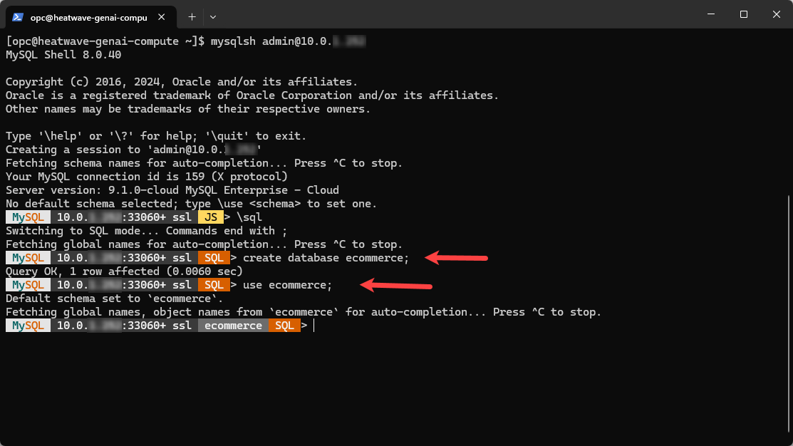

2. Create a stored procedure for sentiment analysis.

    ```bash
    <copy> delimiter // </copy>
    ```

    ```bash
    <copy>CREATE PROCEDURE SENTIMENT_ANALYSIS_TEXT(
    IN review TEXT,
    OUT processed_sentiment VARCHAR(20)
    ) LANGUAGE JAVASCRIPT AS $$
    let prompt = `Classify the review into NEGATIVE or POSITIVE \n${review}.
    Please provide a single word to describe the sentiment: "POSITIVE" or "NEGATIVE". \nSentiment:`;
    let sentiment = ml.generate(prompt);
    processed_sentiment = sentiment.toUpperCase().search("POSITIVE") != -1 ? "POSITIVE" : "NEGATIVE";
    $$; //
    </copy>
    ```

    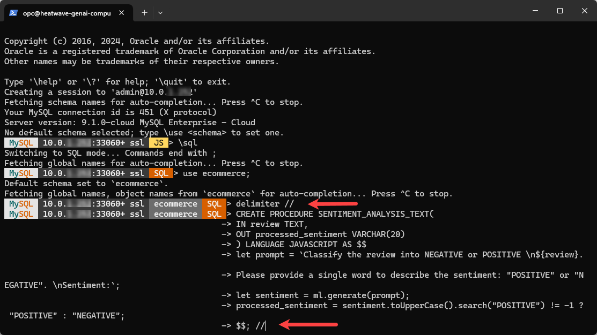

3. Create a stored procedure to summarize and translate reviews.

    ```bash
    <copy>CREATE PROCEDURE SUMMARISE_TRANSLATE_TEXT(
          IN all_reviews TEXT,
          IN language VARCHAR(20),
          OUT processed_summary TEXT
        ) LANGUAGE JAVASCRIPT AS $$
          let summary = ml.generate(all_reviews, {task: "summarization"});
          processed_summary = summary.trim();
           if (language != "english") {  
            let prompt = `Translate the Original Text to ${language}. \n 
                                   - Original Text: "${processed_summary}"\n - ${language} Translation:`;
            let translation = ml.generate(prompt); 
            processed_summary = translation.split('\n')[0];
          }
          $$; //
        </copy>
    ```

    ```bash
    <copy>delimiter ; </copy>
    ```

    


## Task 3: Install Apache App Server

1. Install Apache app server on your compute instance.

    ```bash
    <copy>sudo yum install httpd -y </copy>
    ```
    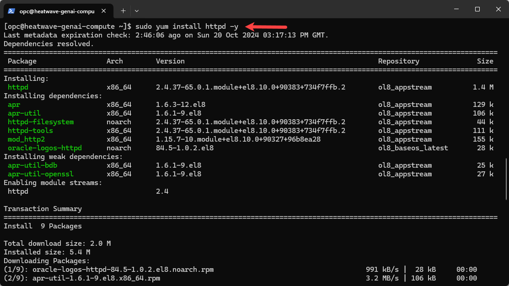

2. Enable Apache.

    ```bash
    <copy>sudo systemctl enable httpd</copy>
    ```

3. Start Apache.

    ```bash
    <copy>sudo systemctl restart httpd</copy>
    ```

4. Setup firewall.

    ```bash
    <copy>sudo firewall-cmd --permanent --add-port=80/tcp</copy>
    ```

5. Reload firewall.

    ```bash
    <copy>sudo firewall-cmd --reload</copy>
    ```

    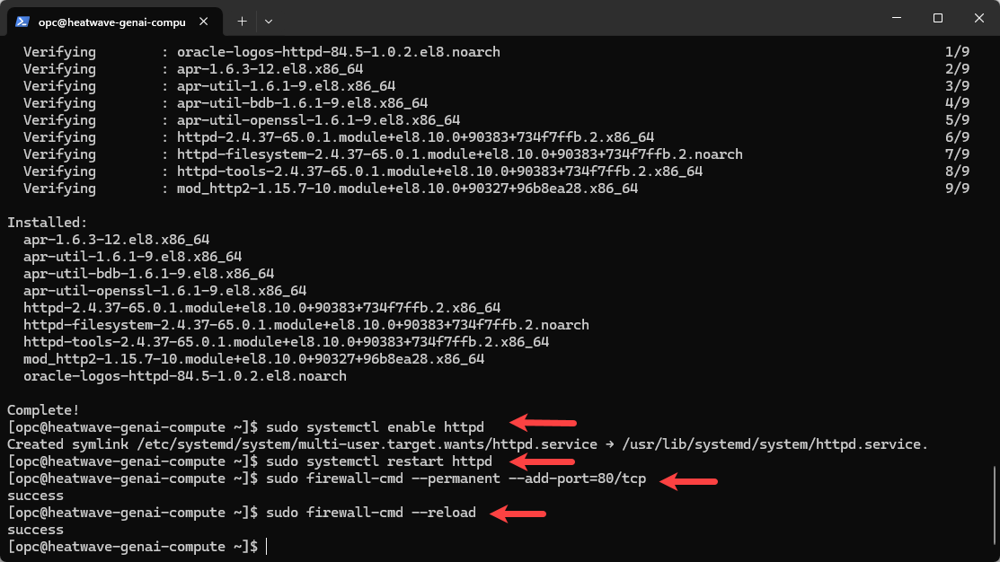

6. From a web browser, test apache from your local machine using the public IP address of your compute instance. You had noted the public IP address of the compute instance in Lab 2, Task 1, Step 13.

    ```bash
    <copy>http://<ComputePublicIPAddress></copy>
    ```
    For example:

    http://129.153.218.143
    
    

## Task 4: Install PHP

1. Install PHP 7.4 on your compute instance.

    ```bash
    <copy> sudo dnf module install php:7.4 -y</copy>
    ```

    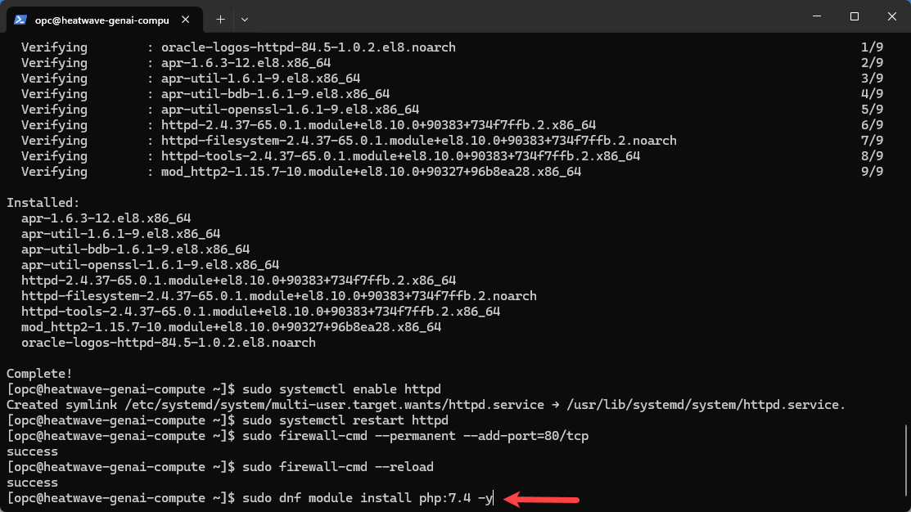

2. Install associated PHP libraries.

    ```bash
    <copy>sudo yum install php-cli php-mysqlnd php-zip php-gd php-mbstring php-xml php-json -y</copy>
    ```
    
    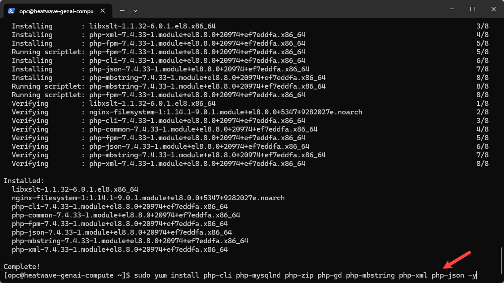

3. View  PHP/MySQL libraries.

    ```bash
    <copy>php -m |grep mysql</copy>
    ```

4. View PHP version.

    ```bash
    <copy>php -v</copy>
    ```

5. Restart Apache application server.

    ```bash
    <copy>sudo systemctl restart httpd</copy>
    ```
     
    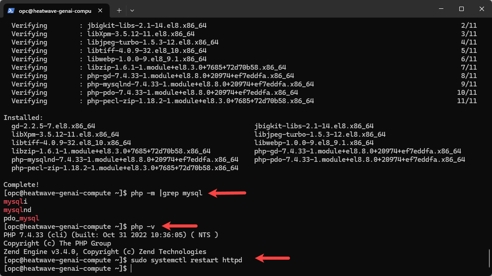

6. Create the test PHP file, info.php.

    ```bash
    <copy>sudo nano /var/www/html/info.php</copy>
    ```
    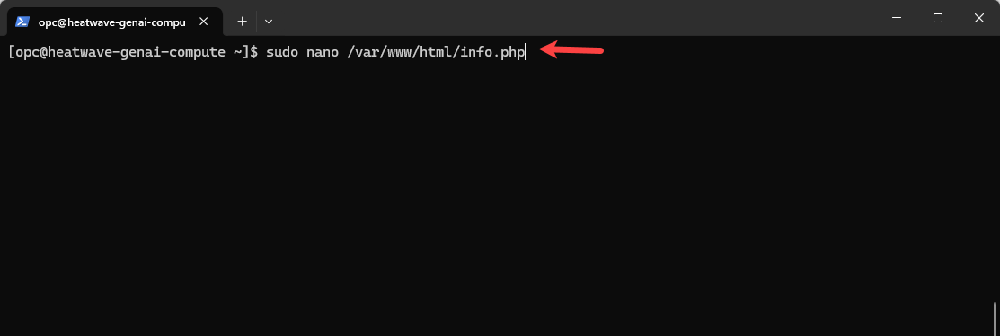

7. Paste the following code in the info.php file.

    ```bash
    <copy><?php
    phpinfo();
    ?></copy>
    ```

    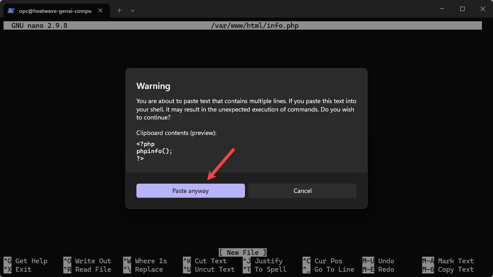

8. Click ctrl+O, followed by **Enter** to save the file.

9. Click ctrl+X to exit the editor.

10. From a web browser, test the info.php file.

    ```bash
    <copy>http://<ComputePublicIPAddress>/info.php</copy>
    ```
    For example:

    http://129.153.218.143/info.php
    
    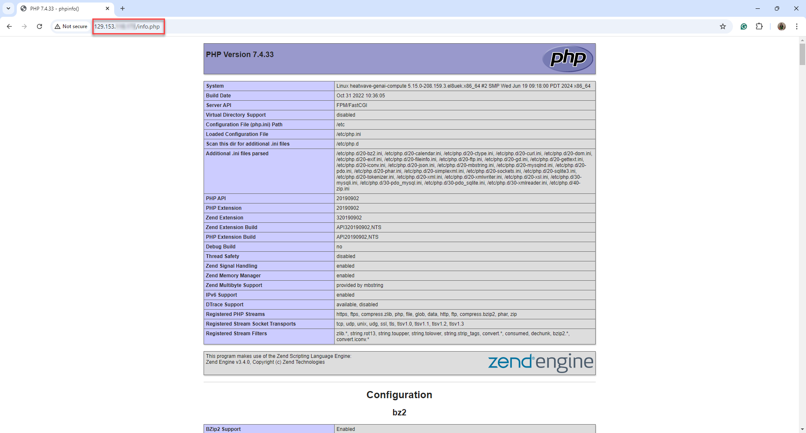

## Task 5: Create HeatWave/PHP Connect Test App

1. Using Visual Studio Code, allow Apache application server to connect to the HeatWave instance.

    ```bash
    <copy> sudo setsebool -P httpd_can_network_connect 1 </copy>
    ```
    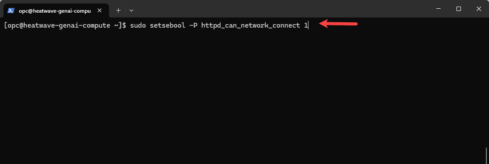

2. Create config.php file.

    ```bash
    <copy>sudo nano /var/www/html/config.php</copy>
    ```

3. Paste the following code in the config.php file. 

     ```bash
    <copy><?php
    // Database credentials
    <?php
    // Database credentials
    define('DB_SERVER', '10.0.1.241');// HeatWave instance IP address
    define('DB_USERNAME', 'admin');
    define('DB_PASSWORD', 'Password123!');
    define('DB_NAME', 'ecommerce');
    //Attempt to connect to HeatWave instance
    $link = mysqli_connect(DB_SERVER, DB_USERNAME, DB_PASSWORD, DB_NAME);
    // Check connection
    if($link === false){
        die("ERROR: Could not connect to the HeatWave instance. " . mysqli_connect_error());
    }
    // Print host information
    echo 'Successfully connected to the HeatWave instance.';
    echo 'Host info: ' . mysqli_get_host_info($link);
    ?>
    </copy>
    ```
    
    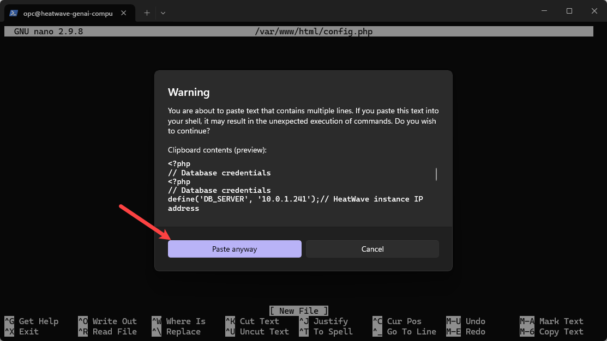

4. Update the following:

    - DB_SERVER: Specify the IP address of the HeatWave instance.
    - DB_USERNAME: Specify administrator username, **admin**, which you had provided in Lab 1, Task 5, Step 5.
    - DB_PASSWORD: Specify the password, which you had provided in Lab 1, Task 5, Step 5.
    - DB_NAME: Specify the schema, **ecommerce**, which you had provided in Lab 4, Task 2, Step 2.

    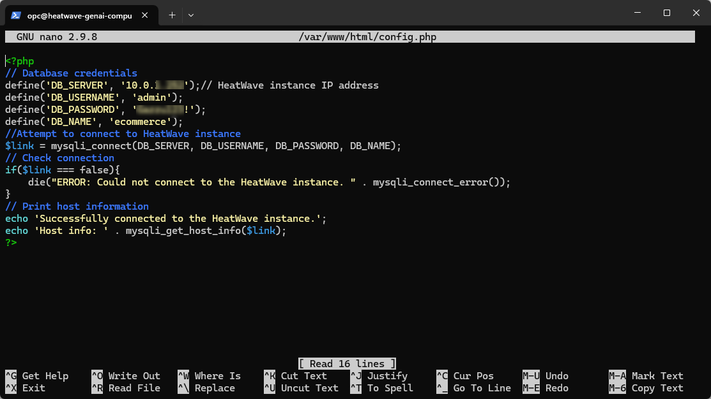

5. Click ctrl+O, followed by **Enter** to save the file.

6. Click ctrl+X to exit the editor.

7. From a web browser, test the config.php file. You should be able to connect to the HeatWave instance.

    ```bash
    <copy>http://<ComputePublicIPAddress>/config.php</copy>
    ```
    For example:

    http://129.153.218.143/config.php
    
    

8. Create the dbtest.php file.

    ```bash
    <copy>sudo nano /var/www/html/dbtest.php</copy>
    ```
    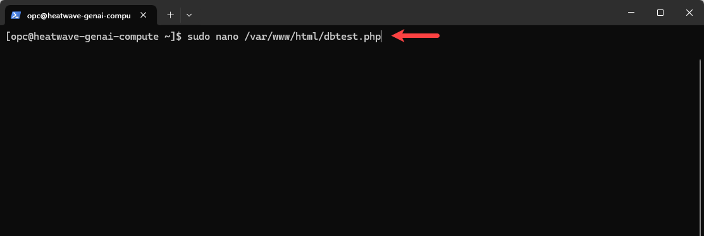

9. Paste the following code in the dbtest.php file. 

    ```bash
    <copy>
    <?php
    require_once "config.php";
    $query = "SELECT user FROM mysql.user;";
    if ($stmt = $link->prepare($query)) {
    $stmt->execute();
    $stmt->bind_result($user);
    echo "<table>";
        echo "<tr>";
        echo "<th>User</th>";
    echo "</tr>";

    while ($stmt->fetch()) {
        echo "<tr>";
        echo "<td>" . $user ."</td>";
        echo "</tr>";
    }

    $stmt->close();
    }
    ?>
    </copy>
    ```
   
    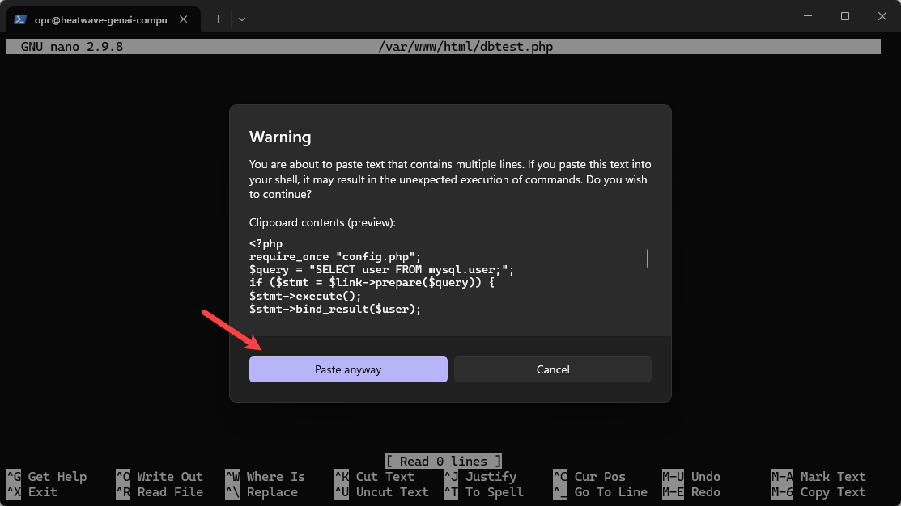

10. Click ctrl+O, followed by **Enter** to save the file.

11. Click ctrl+X to exit the editor.

12. From a web browser, test the dbtest.php file. You should be able to see the MySQL users in the instance.

    ```bash
    <copy>http://<ComputePublicIPAddress>/dbtest.php</copy>
    ```
    For example:

    http://129.153.218.143/dbtest.php
    
    

## Task 6: Deploy HeatWave E-Commerce Application

1. Go to the development folder.

    ```bash
    <copy>cd /var/www/html</copy>
    ```

2. Download the application code.

    ```bash
    <copy>sudo wget https://objectstorage.us-ashburn-1.oraclecloud.com/p/deafmkZGGCfVPr8jMo-V8lZVvYfpZVjnrzPbSFSL7C4nv4dIwkrUziHl1WxgATQd/n/mysqlpm/b/heatwave_genai_ecommerce/o/genai_ecommerce_app.zip</copy>
    ```
    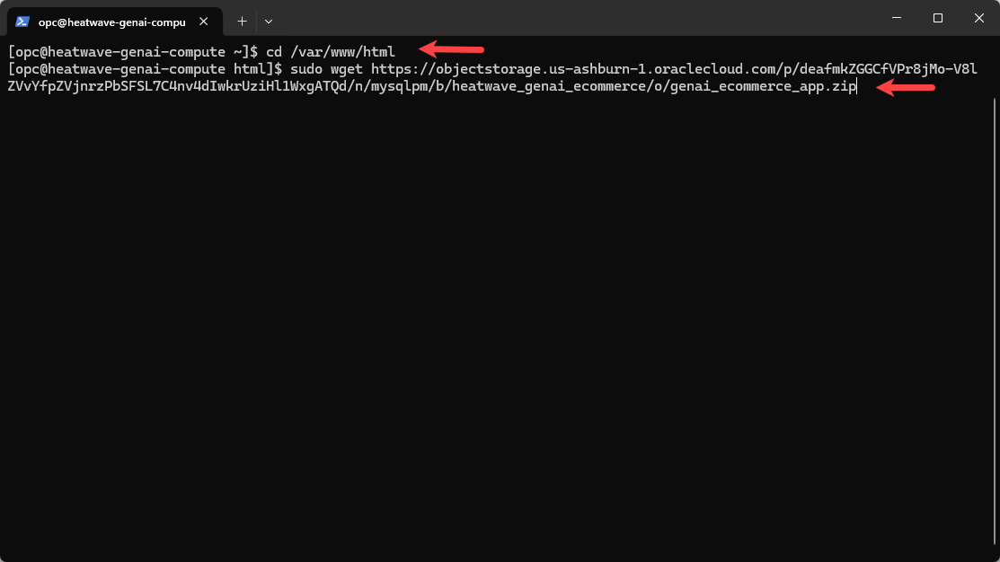

3. Unzip the application code.

    ```bash
    <copy>sudo unzip genai_ecommerce_app.zip</copy>
    ```
4. Go to the app folder.

    ```bash
    <copy>cd genai_ecommerce_app</copy>
    ```

5. View the files in the application folder.

    ```bash
    <copy>ls -l</copy>
    ```

    You should see the following two files:

    - ecommerce.php
    - HeatWaveRAG.php

6. Open the ecommerce.php file.

    ```bash
    <copy>sudo nano ecommerce.php</copy>
    ```

7. Locate the following line in the ecommerce.php file:

    ```bash
    <copy>$rag = new HeatWaveRAG('your_mysql_host', 'your_username', 'your_password', 'ecommerce');</copy>
    ```
    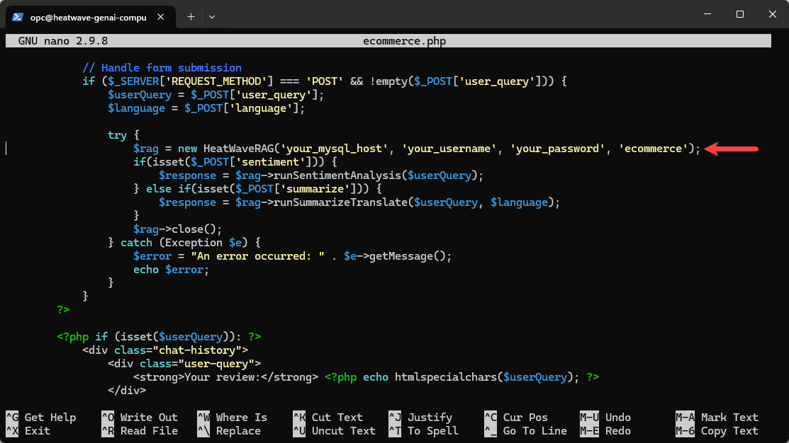

8.  Replace the following:

    - **your\_mysql\_host**: Specify the IP address of the HeatWave instance, **heatwave-genai-db**. For example, 10.0.0.123.
    - **your\_username**: Specify the username you had used for the Heatwave instance. If you arefollowing the lab instructions, specify **admin**.
    - **your\_password**: Specify the pasword you used when creating the HeatWave instance.
    
    Note to not change **ecommerce** as it is the schema name that we had specified for the vector store.

    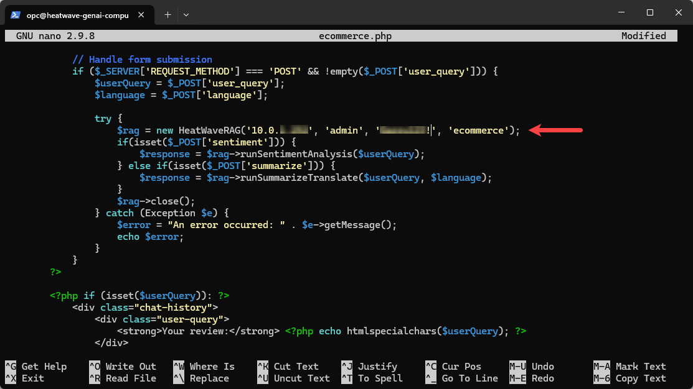

## Task 7: Test HeatWave E-Commerce Application

1. From your web browser, access the ecommerce.php file. 

    ```bash
    <copy>http://<ComputePublicIPAddress>/genai_ecommerce_app/ecommerce.php</copy>
    ```

    For example:
    
    http://129.153.218.143/genai_ecommerce_app/ecommerce.php

2. You'll see a ecommerce page  with a text input field where you can enter reviews.

    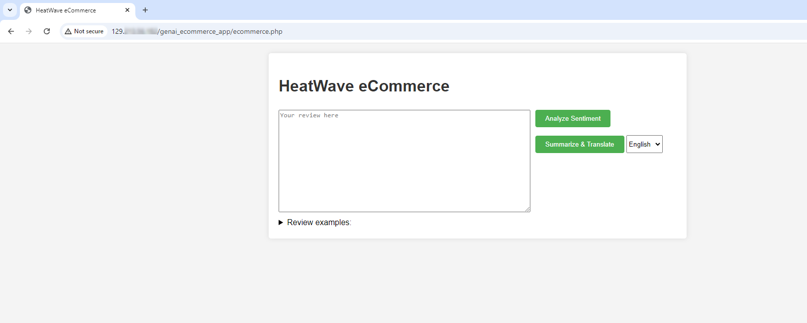

3. Enter your review into the input field and click **Analyze Sentiment**. 

    For example:

    ```bash
    <copy>I highly recommend this T-Shirt. The softness of the cotton material and the comfortable fit make it perfect for everyday wear. The washing instructions are clear and easy to follow, ensuring that the T-Shirt retains its quality. </copy>
    ```

    ```bash
    <copy>The T-Shirt is made from high-quality cotton and is perfect for casual outings. However, the lack of bleach instructions may be a concern for some customers. Overall, I would rate it 3 out of 5 stars. </copy>
    ```

    ```bash
    <copy>This T-Shirt is not up to the mark. The material is not durable enough and the washing instructions are not clear. I would not recommend this product to anyone looking for a long-lasting and easy-to-care-for T-Shirt. </copy>
    ```

    The application will send your review to HeatWave GenAI and analyze the sentiment.

    

4. Enter all reviews into the input field and click **Summarize & Translate** to generate a summary of all reviews.

    ```bash
    <copy>I highly recommend this T-Shirt. The softness of the cotton material and the comfortable fit make it perfect for everyday wear. The washing instructions are clear and easy to follow, ensuring that the T-Shirt retains its quality. The T-Shirt is made from high-quality cotton and is perfect for casual outings. However, the lack of bleach instructions may be a concern for some customers. Overall, I would rate it 3 out of 5 stars. This T-Shirt is not up to the mark. The material is not durable enough and the washing instructions are not clear. Simply awful. I would not recommend this product to anyone looking for a long-lasting and easy-to-care-for T-Shirt. This T-Shirt is not up to my expectations. The material is not breathable enough and the size is too small. I would not recommend this product to others. This T-Shirt is a decent choice for those who prefer soft fabrics and special occasion clothes. However, the lack of bleach instructions may be a concern for some. Overall, it is a good option for casual outings. Poor quality item and doesn't meet its description. False selling. I've recently started going to the gym so needed something other than my normal T-Shirts that I was using. These were on offer for a pack of 3, but even without the offer, they are great value for money. They fit well, and the material is breathable so it's perfect for running on the treadmill which is my main workout routine currently. The quality is excellent, and hold up well after going through the washing machine; No loss of colour, and have retained their shape. Nice product. Fits well. Selected colours all good. Will see how they wear over time, but would currently buy again. Same as the last ones I bought, comfortable, breathable and good t run in but have a strange smell. Hopefully washing them will fix it. These training tops are great for exercise. Loose fitting and stretchy enough to have full range of movement. They have worked well for fitness classes, cardio workouts and strength training. Very comfortable regardless of activity, and do allow you to cool down quicker. If they had a well known brand logo printed on them, you would not know the difference between these and the ones at triple the price. Very happy with them. They are not very durable. just a little bit on the large side, and I’m normally a large, sometimes XL. They have "bobbled" after only 2 washes. Bought this product thinking they look very similar to big brand version, but in reality they are not. The fabric (i don’t know what it is?) is not like that you’d expect, it feels strange and isn’t comfortable in gym in terms of making me feel hot and sweaty instead of wicking away that feeling. Don’t recommend, wouldn’t buy again. Are you kidding they are enormous, bought medium for tighter fit but are like a tent! Not figure hugging at all not even close. Straight up n down.</copy>
    ```

    The application will send your review to HeatWave GenAI and generate a summary of all reviews.

5. If you want to generate a summary of all reviews in any other language, enter the reviews in the input field, select your preferred langauge from the drop down list, and click ****Summarize & Translate**.


    

You may now **proceed to the next lab**.


## Learn More

- [HeatWave User Guide](https://dev.mysql.com/doc/heatwave/en/)

- [HeatWave GenAI Technical Brief](https://www.oracle.com/a/ocom/docs/heatwave-genai-technical-brief.pdf)

- [HeatWave on OCI User Guide](https://docs.oracle.com/en-us/iaas/mysql-database/index.html)

- [MySQL Documentation](https://dev.mysql.com/)

## Acknowledgements

- **Author** - Aijaz Fatima, Product Manager 
- **Contributors** - Perside Foster, MySQL Principal Solution Engineer
- **Last Updated By/Date** - Aijaz Fatima, Product Manager, September 2024